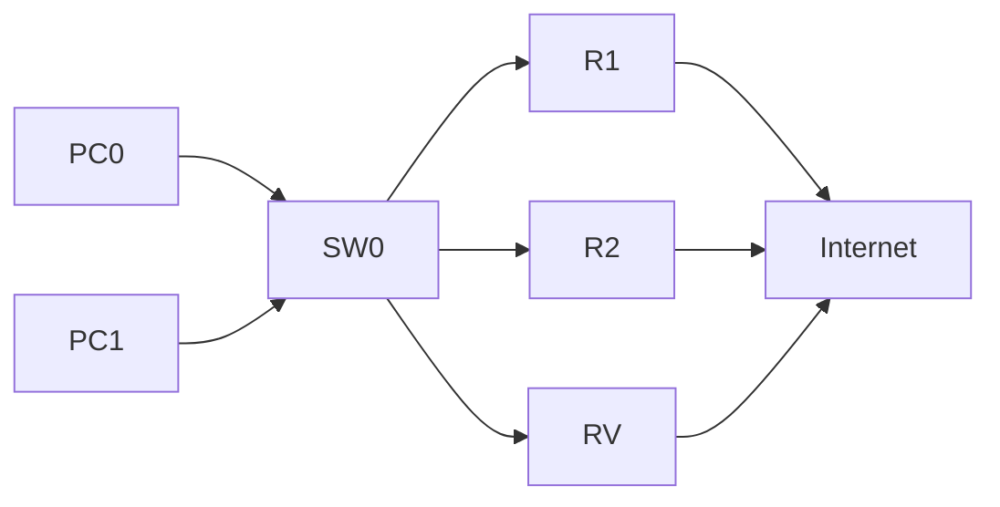

# HSRP (Hot Standy Router Protocol)

Se trata de un router redundante que pueda entrar en activo cuando el router principal caiga.
Es el equivalente a un SAI en el ámbito de las redes.



Los equipos PC0 y PC1 tienen como gateway la ip `192.168.1.1`,
pero los router R1 y R2 tienen las IP `192.168.1.101` y `192.168.1.102` respectivamente.

El RV (Router Virtual) tendrá de IP `192.168.1.1`.

```
R1(config)# interface <interface>
R1(config-if)# ip address <ip> <mask>
R1(config-if)# standby version 2
R1(config-if)# standby <id> ip <ip>
R1(config-if)# standby <id> priority <number>
R1(config-if)# standby <id> preempt
```

El id determina el grupo al que pertenece un router. Los routers de un mismo grupo trabajan
entre ellos para asegurar el funcionamiento de la puerta de enlace.

